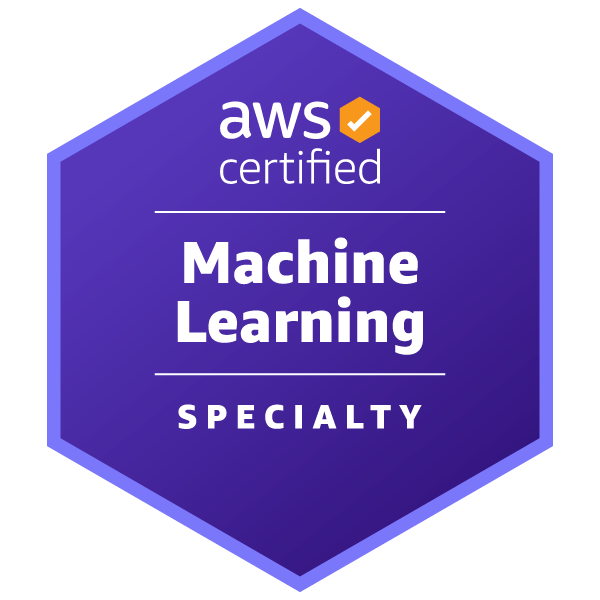
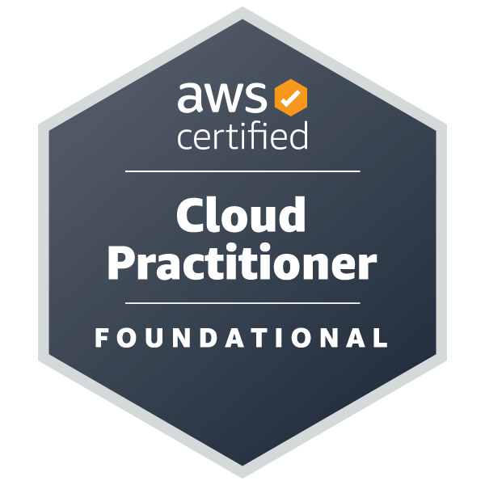

Hi My name is Mohsen
==============================================================================================================================

ML Engineer
-----------
As a results-driven professional with 8 years of successful business management and data analysis experience, I am currently pursuing a Master's degree in Artificial Intelligence (final semester), specializing in machine learning. With a diverse background in programming, data analysis, and multiple industries, I am passionate about leveraging my expertise to automate tasks, enhance accuracy, and uncover hidden insights within data. I am actively seeking a position that allows me to apply machine learning algorithms and technical skills to solve complex problems and drive business growth.

*   🌍  Currently I'm based in Hong Kong
*   ✉️  You can contact me at [m.rahimi.hk@gmail.com](mailto:m.rahimi.hk@gmail.com)
*   ### Certifications
  

  
  

*   ### Skills 

                    

                   
<!--
**mo-rahimi/mo-rahimi** is a ✨ _special_ ✨ repository because its `README.md` (this file) appears on your GitHub profile.
### Hi there 👋
Here are some ideas to get you started:

- 🔭 I’m currently working on met
- 🌱 I’m currently learning AWS, Segamaker.
- 👯 I’m looking to collaborate on ...
- 🤔 I’m looking for help with ...
- 💬 Ask me about ...
- 📫 How to reach me: ...
- 😄 Pronouns: ...
- ⚡ Fun fact: ...
-->
